# Self-Organization of Robots in a Hostile Environment
The project has been realized by the group:

Francisco Garcia

Diego Ruiz

Lucas Vitoriano

João Pedro Volpi

## Description

This project implements an agent-based simulation where robots operate in a hostile environment to collect, transform, and transport hazardous waste to a secure zone. The environment is divided into three zones, each with varying levels of radioactivity. Robots are designed with specific capabilities tailored to their operational zone, handling waste of different radioactivity levels—green, yellow, and red. The simulation explores concepts of self-organization, task allocation, and environmental interaction within robotic agents.

## Installation

To run this simulation, follow these steps:

1. Clone the repository to your local machine.
2. Ensure Python 3. or higher is installed on your system.
3. Install the required dependencies by running `pip install -r requirements.txt` in the terminal within the project directory.

## Usage

To start the simulation, navigate to the project directory and execute:

python run.py

## Features

- **Agent-Based Modeling:** Utilizes green, yellow, and red robots with distinct behaviors and capabilities.
- **Environmental Challenges:** Simulates various zones with differing levels of radioactivity, impacting robot movement and task execution.
- **Task Transformation:** Robots collect and transform waste, simulating a process of hazardous waste management.
- **Visualization:** Provides a graphical representation of the simulation, offering insights into the dynamic interaction between agents and their environment.

## Assummptions:

### Variables

The robot agents in this simulation operate with a knowledge base represented as a Python dictionary with the following structure:
```

knowledge = {
    "waste_type_I_can_hold": self.robot_type,  # Defines the type of waste the robot can hold
    "zone_I_can_move": self.robot_type,        # Indicates the zones where the robot can move
    "pos": (0, 0),                             # Current position of the robot
    "wasteCountHold": 0,                       # Count of waste currently held
    "wasteTypeHold": 0,                        # Type of waste currently held
    "have": [],                                # List of items the robot currently has
    "pos_robot": {                             # Information about the robot's current position
        "radioactivity_level": None,
        "wasteType": None,
        "agent": False
    },
    # Information about the positions North, East, South, and West of the robot
    "pos_N": {"radioactivity_level": None, "wasteType": None, "agent": False},
    "pos_E": {"radioactivity_level": None, "wasteType": None, "agent": False},
    "pos_S": {"radioactivity_level": None, "wasteType": None, "agent": False},
    "pos_W": {"radioactivity_level": None, "wasteType": None, "agent": False},
}
```

### Robot Functions

- **Robots** in this simulation can perform the following functions:

- **Move** Change position within the allowed zone.

- **Collect** Waste: Pick up waste if the robot's capacity allows.

- **Transform Waste** Convert collected waste into a different type, if applicable.

- **Deposit Waste** Place waste in a designated zone or facility.

### Model Restrictions

- No two agents can occupy the same cell. The deliberate() function must avoid cells occupied by another robot.

- Green robots are restricted to the green (low radioactivity) zone.

- Yellow robots can operate in both green and yellow (medium radioactivity) zones.

- Red robots have access to all zones.

- Waste is initially placed randomly within the environment and can be of different types, corresponding to 
the robot that can handle it.

### Procedure with reasoning and without communication 

Determine potential movement blocks based on robot type and zone limitations.

- If a red robot holds a red waste and can move east, it should do so. If not, deposit the waste.

- If a robot holds waste that can be transformed and is in a block with similar waste, transform it.

- If a robot can transform the waste it holds but cannot move east, it should deposit the waste.

- If a robot is on top of waste, it should collect it.

- If there's waste in the neighborhood, move towards the waste.

- Otherwise, move randomly, avoiding cells with other robots.


### Manual simulation

The manual simulation shows two graphs as follows:

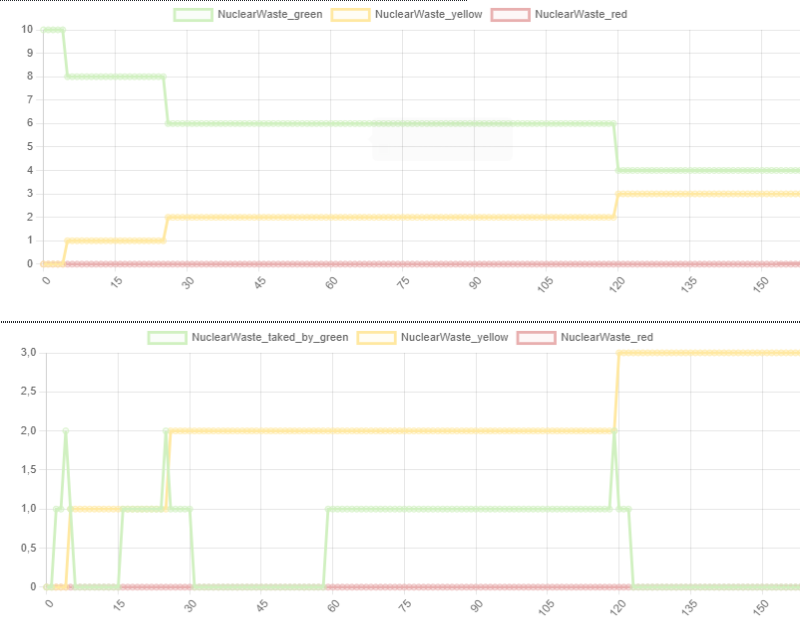

The first show the quantity of each type of wast that exist (so start with N green, 0 yellow and 0 red, and if all is transformed, it finish with N/4 red, 0 green and 0 yellow).

The second plot shows how many waste of each type are in in each step taken by a robot.


### Simulation result

In our project, we conducted a series of simulations over time, represented on the x-axis as steps, while systematically varying key variables to analyze different scenarios. These variables included the quantity of green robots, the dimensions of the environment (width and height), and the total number of waste units collected. Each plot generated from these simulations displays curves that correspond to different values of these variables.

#### Key Metrics

We focused on two primary metrics to gauge the effectiveness and efficiency of our simulations:

1. **Nuclear Waste in Disposal Zone**: This metric tracks the quantity of waste present in the disposal zone at each simulation step. We hypothesized that more effective interaction among robots would result in faster waste collection, leading to a quicker increase in this metric, implying efficiency in waste management. Thus, the ideal scenario depicted by the curves would show that, with an optimal robot interaction, the y-values (waste quantity) peak more quickly as steps progress.

2. **Average Number of Steps Without Waste (by Robot Type)**: This metric serves as a proxy for robot idleness, indicating periods when robots are not engaged in waste collection. We observed that green robots typically start with fewer idle steps as they quickly engage with available waste, but their idleness increases as green waste becomes scarce. Conversely, red robots may show increasing activity over time as they are capable of handling waste in all zones, leading to a decrease in idleness as they continue to find and manage waste.

These metrics were selected because they offer valuable insights from an industrial perspective. The first metric approximates the efficiency of the waste collection process, while the second provides indications about the ongoing need for different types of robots based on waste availability and zone restrictions.

#### Simulation Parameters

Each variable was tested across 100 iterations, with each iteration running for 300 steps to ensure robustness and reliability in the results. This extensive testing framework allowed us to capture a comprehensive range of outcomes under various operational scenarios.

#### Analysis of Simulation Results

Here are some of the most insightful analyses from the results of our simulations:


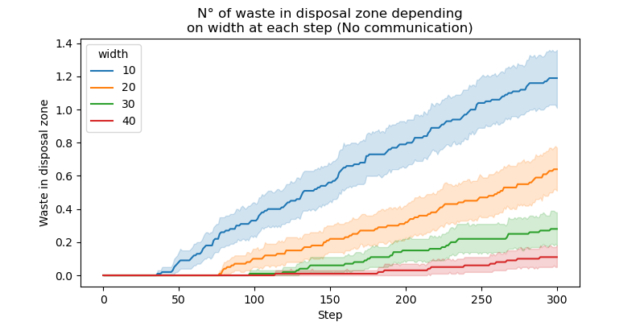


##### Idea 1

In general, the phenomenon that happens is that when it is easier to collect the waste for the green agents (for example when the width or height are smaller), it happens that at first the graphs show that the average time curve without collecting waste is small, but as it is easier to collect it is collected faster and then once it is all collected, the green agents have nothing to do and the amount of time without collecting shoots up enormously. This information is a proxy for when the agents are actually unoccupied (if the curve shoots up a lot it means that a lot of time is spent without picking), which could be useful information in deciding for example when to take the green robots out for maintenance or to put them in another area.

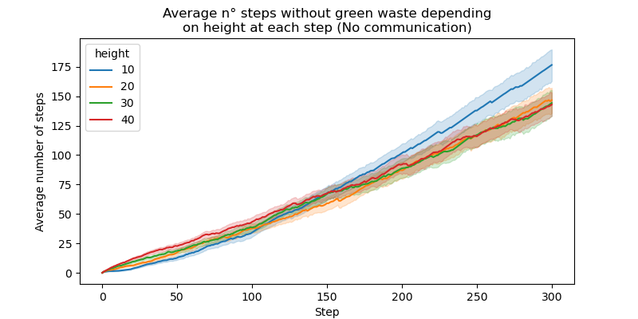

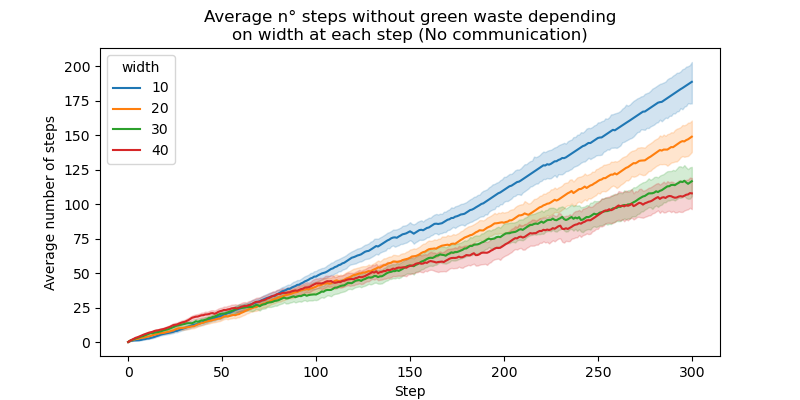


##### Idea 2

The more robots you have, it happens that the average time in which waste has not been collected is similar for all cases (1, 3 or 5 robots), but the more robots there are, the faster they are collected and therefore, the faster the robots become unoccupied and thus the curve of time without collecting anything shoots up faster.

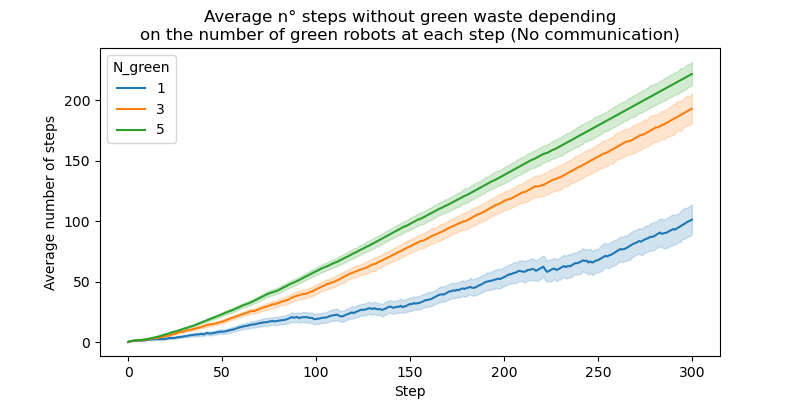


##### Idea 3

Clearly the more waste there is, the less time the green robots are doing nothing at the beginning and then when everything is collected it explodes. The explosion occurs with the same intensity for all cases of different amount of waste, only with more waste it explodes later.

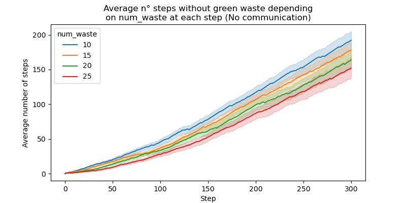


##### Idea 4

In the case of analyzing what happens to the reds further down the supply chain, a similar trend can be seen in the number of times nothing has been collected for each of the curves. In general, all the curves for each situation follow a similar trend up to step 60-80, which is logical given that this is the minimum time it usually takes for eventually the green waste to turn red and the red robots to start working. The interesting thing is that there is a delaying effect in which what happened in the case of green waste tends to be reversed. For example, if before with a small width the green robots were disengaged faster, for the red robots instead at step 300 they are in full work, so that the shape of the curves of average number of steps without doing anything is inverted. Similar happens for the hight.


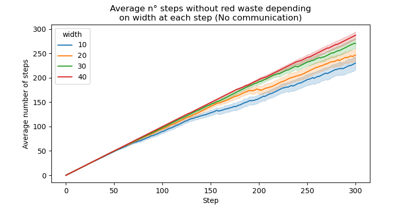


##### Idea 5

In case the map size increases, it will clearly take longer to collect the waste.

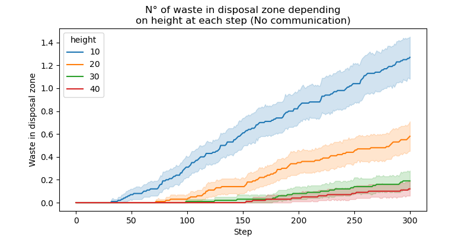


Similarly, you will have more waste collected quickly by having more green robots.

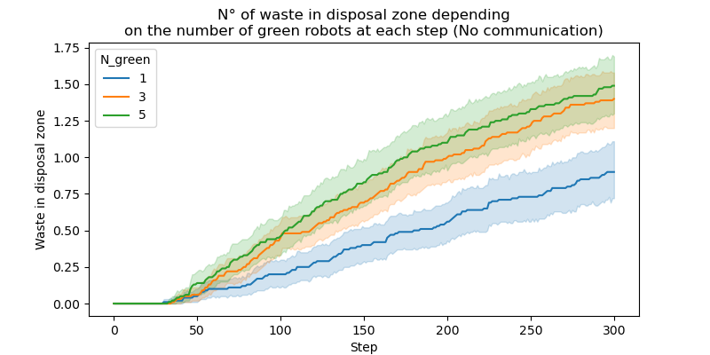

Finally it should be noted that the amount of waste that is found also increases the speed with which it is finally deposited, however, it can be seen that this saturates for more than 15 wastes. So between 15 and 50 wastes there is not much difference between the speed with which the deposit is filled. This is possibly due to the fact that the robots work as fast as they can and they are the bottleneck.

##### Idea 6

The change in performance when communication is added is immense. In the following figure it can be seen that for all cases, with communication, more waste is collected in fewer steps, for all cases (to see the difference, is important to see the y-axis, where it is possible to see how more big are the numbers for the case with communication).

<p align="center">
  
  &nbsp; &nbsp; &nbsp; &nbsp; <!-- Optional spacing -->
  
</p>

<p align="center">
  
  &nbsp; &nbsp; &nbsp; &nbsp; <!-- Optional spacing -->
  
</p>

<p align="center">
  
  &nbsp; &nbsp; &nbsp; &nbsp; <!-- Optional spacing -->
  
</p>

<p align="center">
  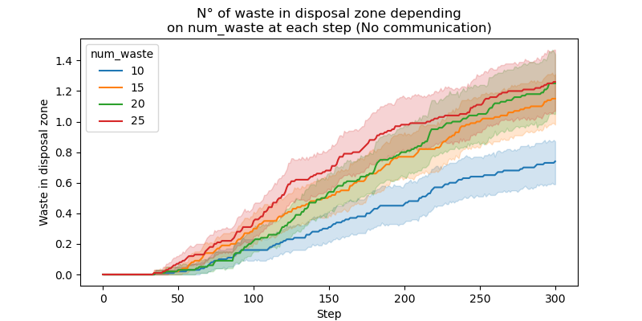
  &nbsp; &nbsp; &nbsp; &nbsp; <!-- Optional spacing -->
  
</p>

The numbers of steps without collecting depending on the fact of having or not communication is almost the same.

<p align="center">
  
  &nbsp; &nbsp; &nbsp; &nbsp; <!-- Optional spacing -->
  
</p>

(Is also the similar situation when seeing different types of num_waste, height and number of robot when we have communication or not. For simplicity this other plot comparation are not showed here, but are in the files).

Finally, to see how the red robots are working, we can see that with the communication it is so much efficient the collection of waste that in 300 steps it is collected much faster that in average red robots will start working before and also finishing the task before such that they start showing that they have nothing to do more inmediatly than the red robots when there is no communication. This last thing make that the curves invert, such that when instances are easier (smaller in height and width), the red robots in communications finish earlier to collect and so start cumulating time without collecting faster.

<p align="center">
  
  &nbsp; &nbsp; &nbsp; &nbsp; <!-- Optional spacing -->
  
</p>

<p align="center">
  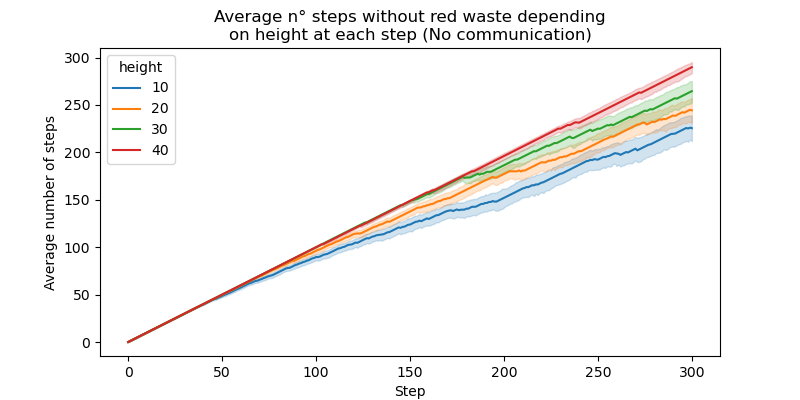
  &nbsp; &nbsp; &nbsp; &nbsp; <!-- Optional spacing -->
  
</p>

## Credits

This project was inspired by the work detailed in [Agent-based model for hazardous waste management](http://emmanuel.adam.free.fr/site/spip.php?article80). Special thanks to all contributors and members of the project team.

## License

This project is licensed under the MIT License - see the LICENSE file for details.

